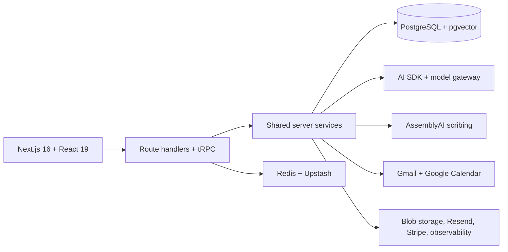

<div align="center">

# getolv

**An AI workspace that helps health and wellness practitioners stay present with patients and keep the work around each visit moving.**

getolv combines live session scribing, patient context, inbox triage, practice operations, and a tool-enabled assistant in one workspace.

</div>

## Overview

Practitioners often split their day across consultations, chart notes, lab results, follow-ups, email, and scheduling. getolv brings those workflows together around the patient. It captures and transcribes consultations, turns session context into structured summaries and follow-up items, organizes connected Gmail accounts with AI-applied labels, and gives practitioners an assistant that can work with real practice data.

The product is built as a full-stack TypeScript monorepo with a Next.js application, shared domain services, typed APIs, AI prompts and evals, and dedicated packages for data, integrations, email, PDF generation, and UI primitives.

## What getolv does

- **Live consultation scribe** — Streams practitioner–patient conversations to AssemblyAI, preserves speaker turns, applies medical vocabulary, and post-processes the final transcript.
- **Session intelligence** — Produces a concise visit summary, live notes, suggested questions, follow-up tasks, risk flags, and working or differential considerations for practitioner review.
- **Patient workspace** — Keeps demographics, medical context, notes, sessions, lab reports, treatment plans, workout plans, email history, and recent activity together.
- **Intelligent inbox** — Connects Gmail, supports natural-language search, associates conversations with patients, and classifies threads as `to respond`, `meeting update`, `fyi`, `notification`, or `marketing`.
- **Practice assistant** — Uses typed tools to retrieve patient records, search mail, inspect the calendar and knowledge base, create patients or sessions, and prepare editable email drafts.
- **Daily briefing** — Combines calendar events, inbox activity, and notes into a focused summary and action list.
- **Clinical workflow tools** — Extracts structured lab data, supports patient-specific reference ranges, generates treatment and workout plans, and exports branded PDFs.
- **Team workspace** — Supports practice onboarding, invitations, role-based membership, two-factor authentication, subscription management, and organization settings.

## Architecture



The application keeps UI, orchestration, domain logic, prompts, and persistence in separate packages. Organization and patient identifiers are carried through service and tool boundaries so tenant-scoped data access can be enforced close to the query layer.

## Technology

| Area                | Stack                                                                     |
| ------------------- | ------------------------------------------------------------------------- |
| Web application     | Next.js 16, React 19, TypeScript, Tailwind CSS, Base UI                   |
| API and client data | tRPC, TanStack Query, Zod                                                 |
| AI                  | AI SDK, Vercel AI Gateway, structured outputs, tool-calling, RAG, Evalite |
| Data                | PostgreSQL, pgvector, Drizzle ORM                                         |
| Authentication      | Better Auth, email OTP, Google OAuth, TOTP 2FA, organizations             |
| Integrations        | AssemblyAI, Gmail, Google Calendar, Resend, Stripe, Vercel Blob           |
| Platform            | Bun workspaces, Turborepo, Redis, Upstash, PostHog, OpenTelemetry         |
| Quality             | Vitest, Testing Library, Testcontainers, Oxlint, Oxfmt, React Doctor      |

## Repository structure

```text
.
├── apps/
│   └── webapp/          # Next.js app, route handlers, workflows, and product UI
├── packages/
│   ├── ai/              # Models, prompts, schemas, and prompt tests
│   ├── app-store/       # Gmail and Google Calendar OAuth drivers
│   ├── cache/           # Redis clients, caching, and rate limiting
│   ├── db/              # Drizzle schema, relations, migrations, and query utilities
│   ├── email/           # React Email templates
│   ├── evals/           # Evalite suites for model and prompt behavior
│   ├── logger/          # Shared client and server observability
│   ├── pdf/             # Branded clinical document templates
│   ├── server/          # Domain services, AI agents and tools, auth, and tRPC routers
│   ├── spoonacular/     # Vendored nutrition and recipe API client
│   ├── tsconfig/        # Shared TypeScript configurations
│   ├── ui/              # Design system, components, hooks, and tokens
│   └── utils/           # Shared utilities
├── globalSetup.ts       # Containerized integration-test infrastructure
├── Makefile             # Environment, database, and maintenance commands
├── docker-compose.yml   # Local PostgreSQL service
└── turbo.json           # Monorepo task graph
```

## Local development

### Prerequisites

- [Bun](https://bun.sh/) `1.3.14`
- Docker with Compose
- PostgreSQL and Redis connection details
- Provider credentials for the product capabilities you want to exercise

### Setup

1. Install workspace dependencies:

    ```bash
    bun install
    ```

2. Start the local PostgreSQL service:

    ```bash
    docker compose up -d app-db
    ```

3. Create `apps/webapp/.env.local`. Core application startup requires database, Redis, authentication, and Stripe configuration. AI, scribing, mail, calendar, email delivery, file storage, analytics, and weather features require their corresponding provider credentials.

    Maintainers with access to the linked Vercel project can pull the configured environment instead:

    ```bash
    make env
    ```

4. Apply the database migrations:

    ```bash
    make migrate
    ```

5. Start the development tasks:

    ```bash
    bun dev
    ```

    The web application is served at [http://localhost:3000](http://localhost:3000).

## Quality checks

```bash
bun run test       # Vitest suite; uses Docker-backed PostgreSQL and Redis
bun typecheck      # TypeScript checks across the workspace
bun lint           # Oxlint and Oxfmt verification
bun react-doctor   # React-specific diagnostics
bun eval:ci        # Prompt and model behavior evals
```

Tests cover service behavior, integrations, schemas, route guards, UI hooks, and reusable packages. AI behavior has separate eval suites for session intelligence, daily summaries, patient summaries, mail classification, lab analysis, workout plans, RAG answers, and chat titles.

## Responsible use

getolv is an active product prototype. AI-generated summaries, diagnoses, plans, and follow-up suggestions are assistive outputs and must remain subject to qualified practitioner review. A real-world deployment handling patient information must complete the privacy, security, regulatory, consent, retention, and clinical validation work required in its operating jurisdiction.
