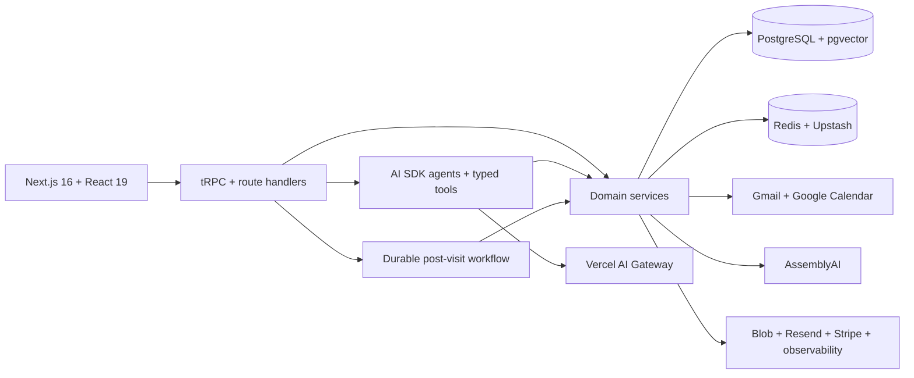

<div align="center">

# getolv

**An AI-assisted practice workspace for health and wellness professionals.**

getolv brings the work before, during, and after a patient visit into one context-rich system—from live scribing and clinical follow-up to inbox and calendar coordination.

</div>

## Purpose

Independent health and wellness practices often manage consultations, patient records, lab results, notes, follow-ups, email, and scheduling across disconnected tools. That fragmentation pulls attention away from the patient and makes important context harder to recover when it is needed.

getolv explores a patient-centered alternative. The patient record—not an individual chat or appointment—is the organizing layer for the product. Live sessions, longitudinal context, practitioner notes, lab history, plans, communications, and operational tasks all contribute to the same workspace. AI is used to reduce clerical work and surface relevant context while keeping the practitioner responsible for every clinical decision.

This repository contains the full-stack product prototype: the application, domain services, persistence layer, AI agents and prompts, third-party integrations, document generation, automated tests, and model evals.

## Product experience

| Stage              | How getolv supports the practitioner                                                                                                                                                                                          |
| ------------------ | ----------------------------------------------------------------------------------------------------------------------------------------------------------------------------------------------------------------------------- |
| **Prepare**        | Reorient from a patient overview that combines demographics, medical context, previous sessions, notes, lab reports, plans, and recent activity. A daily briefing brings together calendar events, inbox activity, and notes. |
| **Consult**        | Capture a live, speaker-aware transcript with medical key terms. Session intelligence incrementally surfaces a working summary, risk flags, useful follow-up questions, tasks, and considerations for practitioner review.    |
| **Follow through** | Finalize the transcript, refresh the patient summary and clinical state, generate treatment or workout plans, export branded PDFs, and carry unfinished work into the next interaction.                                       |
| **Operate**        | Manage patient-linked Gmail threads, a Google Calendar, practice notes, team membership, invitations, roles, two-factor authentication, and subscriptions from the same workspace.                                            |

The assistant is connected to typed application tools rather than a standalone chat context. Depending on scope, it can retrieve patient information, inspect sessions and labs, search mail, read calendar events, query an organization knowledge base, create patients or sessions, analyze lab data, generate workout plans, and prepare editable email drafts.

## Engineering highlights

- **Durable session pipeline** — Live transcript turns are persisted as the consultation progresses. When a session closes, a background workflow reprocesses the private recording with AssemblyAI's medical model, normalizes speaker roles, refreshes session intelligence and the longitudinal patient summary, synchronizes a treatment plan, and deletes the transient audio after successful processing.
- **Typed AI boundary** — AI prompts and output schemas live in `packages/ai`; model behavior is implemented with AI SDK agents, structured outputs, and typed tools in `packages/server`; prompt and model behavior is exercised independently through Evalite suites in `packages/evals`.
- **Organization-scoped data access** — Better Auth provides organizations, invitations, roles, email OTP, Google OAuth, and TOTP-based two-factor authentication. Protected tRPC procedures require an active organization, and organization identifiers continue through services, agent tools, database records, OAuth connections, and RAG documents.
- **Grounded knowledge retrieval** — The RAG pipeline accepts text, PDF, DOCX, and common text-based files, extracts and chunks their content, stores organization-scoped embeddings in PostgreSQL, and retrieves them through a pgvector HNSW index.
- **Isolated integration layer** — Gmail and Google Calendar drivers, OAuth token refresh, provider-specific types, and handlers are kept in a dedicated package. A scheduled route refreshes stored OAuth connections without coupling provider logic to the UI.
- **Layered quality strategy** — Vitest covers application behavior, services, schemas, integrations, utilities, and UI hooks. Testcontainers supplies disposable PostgreSQL and Redis infrastructure, while separate AI evals measure session intelligence, summaries, mail classification, lab analysis, workout generation, RAG answers, and chat titles.

## System architecture



The web application owns rendering, route handlers, and workflow entry points. Shared packages own domain behavior and provider boundaries, which keeps patient and organization rules out of the component layer and makes AI tools reuse the same services as the typed API.

### Suggested code tour

- [Post-visit workflow](apps/webapp/src/workflows/session-transcript-post-processing.ts) — durable transcription, intelligence refresh, treatment-plan synchronization, and audio cleanup.
- [Session intelligence service](packages/server/src/services/session-intelligence.ts) — assembles longitudinal patient context, requests a structured model output, normalizes it, and persists the result.
- [Dashboard agent](packages/server/src/ai/agents/dashboard-chat-agent.ts) — scopes a tool-enabled agent to the current user and organization at runtime.
- [Prompt and output contracts](packages/ai/src/prompts.ts) — keeps production prompts and their Zod schemas in a shared, testable package.
- [Organization-aware tRPC setup](packages/server/src/trpc/create-getolv-trpc.ts) — establishes authenticated and active-organization procedure boundaries.
- [RAG service](packages/server/src/services/rag.ts) — handles chunking, embeddings, persistence, and organization-scoped vector retrieval.

## Technology

| Area                       | Stack                                                                           |
| -------------------------- | ------------------------------------------------------------------------------- |
| Application                | Next.js 16, React 19, TypeScript, Tailwind CSS, Base UI                         |
| API and client data        | tRPC, TanStack Query, Zod, SuperJSON                                            |
| AI                         | AI SDK, Vercel AI Gateway, structured outputs, tool-calling, RAG, Evalite       |
| Data                       | PostgreSQL, pgvector, Drizzle ORM                                               |
| Identity and billing       | Better Auth, Redis secondary storage, Google OAuth, email OTP, TOTP 2FA, Stripe |
| Integrations               | AssemblyAI, Gmail, Google Calendar, Resend, Vercel Blob                         |
| Platform and observability | Bun workspaces, Turborepo, Upstash, PostHog, OpenTelemetry, durable workflows   |
| Quality                    | Vitest, Testing Library, Testcontainers, Oxlint, Oxfmt, React Doctor            |

## Repository structure

```text
.
├── apps/
│   └── webapp/          # Next.js application, API routes, workflows, and product UI
├── packages/
│   ├── ai/              # Model registry, prompts, output schemas, and prompt tests
│   ├── app-store/       # Gmail and Google Calendar drivers and OAuth support
│   ├── cache/           # Redis clients, caching, and rate limiting
│   ├── db/              # Drizzle schema, relations, migrations, and query utilities
│   ├── email/           # Localized React Email templates
│   ├── evals/           # Evalite suites for prompt and model behavior
│   ├── logger/          # Shared client and server observability
│   ├── pdf/             # Branded clinical document templates
│   ├── server/          # Domain services, AI agents and tools, auth, and tRPC routers
│   ├── spoonacular/     # Vendored nutrition and recipe API client
│   ├── tsconfig/        # Shared TypeScript configurations
│   ├── ui/              # Design system, components, hooks, and design tokens
│   └── utils/           # Shared cross-package utilities
├── globalSetup.ts       # Containerized integration-test infrastructure
├── Makefile             # Environment, database, and maintenance commands
├── docker-compose.yml   # Local PostgreSQL service
└── turbo.json           # Monorepo task graph
```

## Local development

### Prerequisites

- [Bun](https://bun.sh/) `1.3.14`
- Docker with Compose and a PostgreSQL 17 image that includes pgvector
- Provider credentials for the workflows you want to exercise
- Stripe CLI and ngrok when running the complete root development workflow

### Setup

1. Install the workspace dependencies:

    ```bash
    bun install
    ```

2. Start PostgreSQL:

    ```bash
    docker compose up -d app-db
    ```

    The migration history creates the `vector` extension for organization knowledge retrieval. If the configured PostgreSQL image does not include pgvector, point `DATABASE_URL` at a pgvector-enabled PostgreSQL 17 instance before migrating. The integration-test environment already uses `pgvector/pgvector:pg17`.

3. Create `apps/webapp/.env.local`. Core startup requires database, Redis, authentication, and Stripe configuration. AI, scribing, mail, calendar, email delivery, file storage, analytics, maps, and weather features require their corresponding provider credentials.

    Maintainers with access to the linked Vercel project can pull the configured environment instead:

    ```bash
    make env
    ```

4. Apply the database migrations:

    ```bash
    make migrate
    ```

5. Start the complete development workflow:

    ```bash
    bun dev
    ```

    This starts the web application, React Email preview, AI SDK development tools, Stripe webhook forwarding, and the Blob callback tunnel. The web application is available at [http://localhost:3000](http://localhost:3000).

    To run only the web application after configuring its environment:

    ```bash
    cd apps/webapp
    bun dev
    ```

## Verification

```bash
bun run test       # Vitest suite with Docker-backed PostgreSQL and Redis
bun typecheck      # TypeScript checks across all workspaces
bun lint           # Oxlint and Oxfmt verification
bun react-doctor   # React-specific diagnostics
bun eval:ci        # Prompt and model behavior evals; requires model credentials
```

## Project status and responsible use

getolv is an active product prototype and portfolio project, not a certified clinical system. AI-generated summaries, working hypotheses, plans, and follow-up suggestions are assistive outputs and require review by a qualified practitioner. Any real-world deployment handling patient information would also need the privacy, security, consent, retention, regulatory, and clinical validation work required in its operating jurisdiction.
